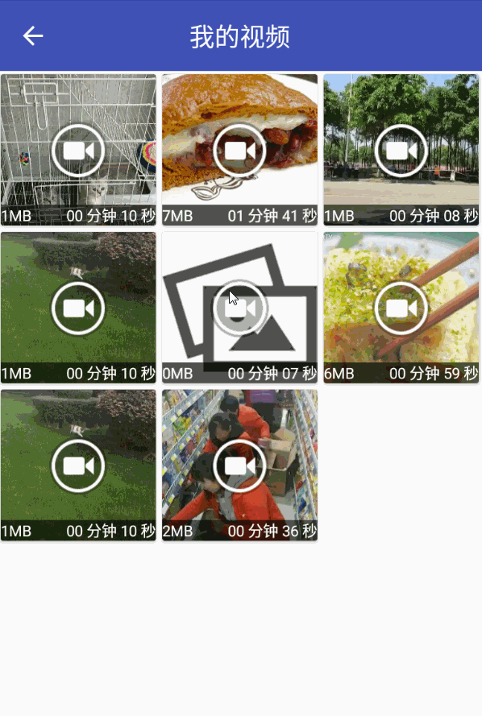

# SuperSelector
## 基于MVP的图片视频选择器+Material+Glide+leakcanary+butterknife

## **简介**
一款遵循**Material Design**风格的图片视频选择器
- MVP模式，基于API25(7.1.1)开发，加入动态权限
- 使用RecycleView展示Grid列表
- 支持选择后预览
- leakcanary简单引入
- Glide加载缓存图片

## **版本**

#### V0.2
- 完成选择视频
- 使用CardView展示条目
#### V0.1
- 框架搭建完毕
- 完成图片选择和预览 

## **截图**
#### 选择图片
 
#### 选择视频

## **About me**
* [Email](LYYX@outlook.com)
* [WeiBo](http://weibo.com/liuyang6)
* [Blog](http://blog.csdn.net/ly502541243)
